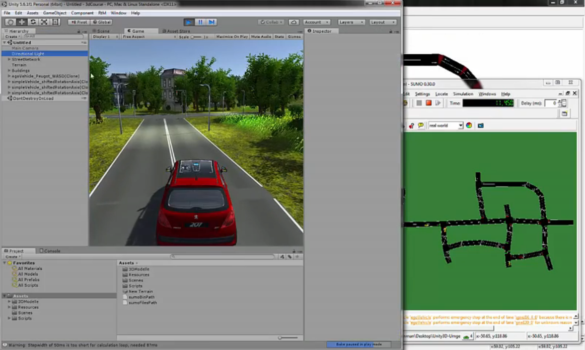

# SUMO3d

A partial unity 3D project for coupling SUMO and Unity3D

Link to youtube video:
 

**IMPORTANT:**

Due to the numerous questions about publishing this project you will find it here. 

I unfortunately had to remove all questionable third party elements from the project due to unknown licenses (e.g. ALL 3d models and assets!). The most important parts are located within 3dCourse\Assets\Scripts. You WILL have to put time into this to get it running (you should start a new unity3D project anyway). I am not a professional programmer and did not maintain this for quite a long time. It was just meant to be an illustration without taking care of clean/beautiful code! Also notice that many comments are in the german language and I had no time to translate or clean the code. So please don't expect a ready-to-go piece of software ;-)

The Folder GenerateSimulationForUnity3D contains everything for a quick road network generation using an embedded SUMO version. The unity3d project was in my case also linked to this sumo version. The folder 3dCourse contains the partial unity3D project, mainly cosisting of the remaining scripts.

This project contains a ported version of Traci4J (https://github.com/egueli/TraCI4J) to C#. Unity3d therefore is able to communicate to SUMO.

**There are a few files you could download:**

sumo (I used v0.31.0) --> GenerateSimulationForUnity3D\AdditionalExecutables\sumo-svn

You can have a look into the code to get an idea how the 3d models were included (PathConstants.cs)

Buildings, Traffic Lights etc.:
Various 3D models --> 3dCourse\Assets\3DModelle\*

Helper for defining the roads:
SuperSplinesPro --> 3dCourse\Assets\3DModelle\HilfsAssets

Textures and Plants:
EasyRoads3D Free --> 3dCourse\Assets\3DModelle\3DStrasseVegetation\
NatureStarterKit2 --> 3dCourse\Assets\3DModelle\3DStrasseVegetation\

Hopefully you can get it to run, have fun!

This project contains GNU General Public License licensed parts from the Traci4J project and due to this is also published under the same license.

